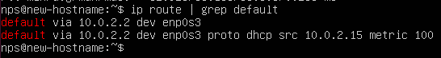
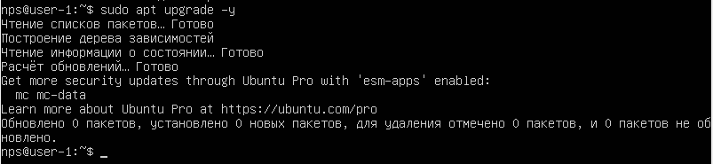
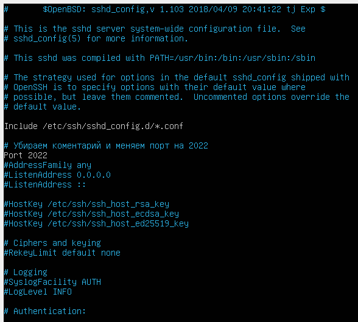
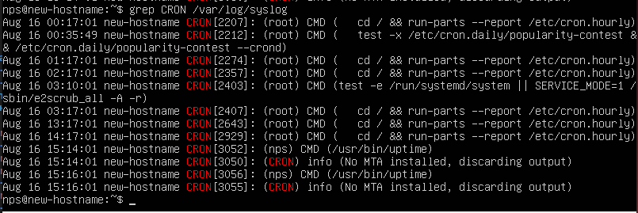

# Операционные системы UNIX/Linux (Базовый)

## Part 1. Установка ОС
### cat/etc/issue<br>


## Part 2. Создание пользователя
### 2.0 Создание нового пользователя
### sudo adduser vassagot<br>


## 2.0.0 Вызов команды для создания пользователя - sudo adduser vassagot


## 2.1.1 Убедимся, что пользователь vassagot присутствует в системе: <br>


## 2.2.0 Добавление пользователя в группу adm с помощью команды usermod:
### sudo /usr/sbin/usermod -aG adm vassagot  <br>
### G -указывает список дополнительных групп  <br>
### a -добавляет пользователя в группу <br>


## 2.3.0 Проверка, что пользователь vassagot присутствует в файле /etc/passwd . После команды: cat /etc/passwd <br>


## 2.3.1 Проверка создания пользователя и добавления в группу, используя команду groups vassagot:
### groups vassagot<br>

## Эта команда показывает, что пользователь vassagot теперь является членом группы adm.


## 2.3.2 Проверка создания пользователя и добавления в группу, используя команду id:


## Part 3. Настройка сети ОС
## 3.0 Задай название машины вида user-1

### sudo hostnamectl set-hostname user-1 <br>


## 3.1. Проверилa изменение с помощью команды: hostnamectl


## 3.2. Установилa временную зону, соответствующую моему текущему местоположению.
### sudo timedatectl set-timezone Europe/Moscow - моя временная зона


## 3.3. Проверилa текущую временную зону: timedatectl 


## 3.4. Вывелa названия сетевых интерфейсов с помощью консольной команды.
### lp link show  / ifconfig - a <br>


### * Объяснение наличия интерфейса lo

### * Интерфейс lo — это "loopback" интерфейс, который используется системой для самообращения, то есть для связи внутри той же самой машины. Он всегда имеет IP-адрес 127.0.0.1 и используется для тестирования и диагностики сетевой системы.


### Интерфейс lo в Linux представляет собой виртуальный сетевой интерфейс, также известный как интерфейс loopback. Интерфейс lo имеет особое назначение: он позволяет программам и службам общаться между собой внутри одной машины, минуя физическую сеть.     • IP-адрес: Обычно lo имеет IP-адрес 127.0.0.1, который является стандартным адресом loopback в IPv4. Для IPv6 адресом loopback является ::1.

### Не требует подключения: Интерфейс lo всегда активен и не требует физического подключения к сетевому оборудованию.

### Использование: Используется для локального взаимодействия между процессами на одном компьютере. Например, когда браузер запрашивает веб-страницу, запрос сначала направляется на lo, а затем, если требуется, перенаправляется на соответствующий сетевой интерфейс для выхода в Интернет.

### Интерфейс lo важен для обеспечения внутренних сетевых коммуникаций внутри системы, особенно для протоколов, таких как SSH, FTP и других, которые используются для управления и мониторинга системы. Благодаря этому интерфейсу, различные компоненты системы могут обмениваться данными, даже если физическая сеть не доступна или не требуется для данной операции.


### Дополнительно -------

### Интерфейс lo (loopback) позволяет компьютеру "общаться" с самим собой, что важно для тестирования и внутренних процессов. Адреса 127.0.0.1 (IPv4) и ::1 (IPv6) всегда используются для этого. Этот интерфейс никогда не используется для внешней сети.


### Как это работает?

### Представь, что твой компьютер имеет внутреннюю почтовую систему. Если одна программа хочет отправить сообщение другой программе на том же компьютере, она может воспользоваться этой внутренней почтовой системой (интерфейсом lo), чтобы передать сообщение напрямую.

### IP-адрес 127.0.0.1, который используется этим интерфейсом, всегда указывает на сам компьютер. Это как адрес «самого себя» в сети.

### Зачем нужен интерфейс lo?

### 1.  Тестирование и диагностика: Если тебе нужно проверить, работает ли сетевой стек системы или сетевые программы, можно использовать lo, чтобы убедиться, что всё функционирует правильно. Например, команда ping 127.0.0.1 проверяет, что сетевой стек работает, потому что она отправляет данные самому себе через этот интерфейс.

### 2. Локальные связи: Много программ и сервисов на компьютере используют этот интерфейс для общения между собой. Например, веб-сервер может отправлять запросы на сам себя через lo.

### Пример: Давай представим ситуацию в офисе, где один сотрудник отправляет документы другому сотруднику в той же комнате. Он не должен выходить из офиса или идти по коридору — он просто передаёт документы через внутреннюю почтовую службу, которая есть в офисе. Вот так же работает интерфейс lo в компьютере: он позволяет программам общаться друг с другом внутри одной системы без необходимости выхода в интернет или локальную сеть.

### Команды для проверки
### Команды для проверки работы интерфейса lo:


### ip addr show  - bash
### 3.5. Команды для проверки работы интерфейса lo - ip addr show. А также что бы посмотреть сетевые интерфейсы и их настройки:

### Здесь ты увидишь интерфейс lo с IP-адресом 127.0.0.1.


### Проверить связь с самим собой:
### 3.6. ping 127.0.0.1 - bash

### Эта команда отправляет пакеты данных самому себе через интерфейс lo, и если всё работает правильно, ты увидишь ответы.

### Таким образом, интерфейс lo помогает компьютеру проверять и использовать свои собственные сетевые функции без выхода в внешнюю сеть.


## 3.7 Используя консольную команду, получи ip адрес устройства, на котором ты работаешь, от DHCP сервера.
### sudo dhclient -v enp0s3<br>


### sudo dhclient -v enp0s3 активно запрашивает IP-адрес у DHCP-сервера для указанного интерфейса (enp0s3). Это гарантирует, что IP-адрес действительно был получен от DHCP-сервера в момент выполнения команды, а не просто отображается уже назначенный IP-адрес, который мог быть получен ранее.


### sudo dhclient -v enp0s3 предоставляет подробный вывод процесса получения IP-адреса, включая все сообщения от DHCP сервера.

### DHCP, или Dynamic Host Configuration Protocol (Динамический Протокол Конфигурации Хоста), это сетевой протокол, используемый для автоматического назначения IP-адресов и других параметров связи устройствам, подключенным к сети, используя клиент-серверную архитектуру. 

### IP-адрес, полученный от DHCP-сервера, может меняться


### Почему это происходит?

### 1. DHCP-сервер (Dynamic Host Configuration Protocol) автоматически назначает IP-адреса устройствам в сети на ограниченный период времени (обычно называется "арендой" или "lease").

### 2. По истечении срока аренды устройство может получить тот же адрес, но это не гарантировано. DHCP-сервер может назначить другой IP-адрес в зависимости от наличия свободных адресов и настроек сервера.

### 3. Если устройство отключается от сети и снова подключается через некоторое время, оно также может получить другой IP-адрес.

### Закрепление IP-адреса. Чтобы сделать IP-адрес постоянным, можно:

### 1. Настроить статический IP-адрес вручную на устройстве.
### 2. Зарезервировать конкретный IP-адрес для устройства на DHCP-сервере, основываясь на его MAC-адресе


## 3.8. Определи и выведи на экран внешний ip-адрес шлюза (ip) и внутренний IP-адрес шлюза, он же ip-адрес по умолчанию (gw).

### Внешний IP-адрес можно получить, отправив запрос на внешний сервис, который возвращает публичный IP-адрес. Пример команды с использованием curl:<br>


### Внутренний IP-адрес шлюза (gw): Этот адрес можно получить с помощью команды ip route или route.<br>



## 3.9 Задай статичные (заданные вручную, а не полученные от DHCP сервера) настройки ip, gw, dns (используй публичный DNS серверы, например 1.1.1.1 или 8.8.8.8).
### sudo vim /etc/netplan/01-netcfg.yaml<br>


### Применила новые настройки, выполнив команду:


## 3.10 Теперь можем проверить доступность удаленных хостов, используя команду ping. Отправляем ICMP эхо-запросы на 1.1.1.1 и ya.ru:
### ping -c 4 1.1.1.1<br>


Адрес **1.1.1.1** — это публичный IP-адрес, который принадлежит компании **Cloudflare**. Cloudflare использует его для своего DNS-сервиса (Domain Name System). Этот адрес предоставляет доступ к одному из самых быстрых и популярных публичных DNS-серверов, используемых для преобразования доменных имен (например, `example.com`) в IP-адреса.

Когда вы используете команду `ping -c 4 1.1.1.1`, вы отправляете четыре ICMP-запроса на этот DNS-сервер, проверяя его доступность и отклик. Этот DNS-сервер часто используется для диагностики сетевых проблем и проверки подключения к интернету, так как он обычно стабилен и имеет глобальную доступность.


### ping -c 4 ya.ru<br>


Команда `ping -c 4 ya.ru` выполняет следующее:

- **`ping`** — это утилита в операционных системах на базе Unix (и в Windows), которая проверяет доступность удаленного узла (сервера, компьютера) в сети. Она отправляет ICMP (Internet Control Message Protocol) пакеты на указанный хост и измеряет время, за которое пакеты доходят до цели и возвращаются обратно.
  
- **`-c 4`** — это параметр, указывающий количество отправляемых пакетов. В данном случае, `4` означает, что команда отправит четыре ICMP-запроса (или "пинга") к указанному узлу.
  
- **`ya.ru`** — это доменное имя, в данном случае это домен Яндекса.

Таким образом, команда отправляет четыре ICMP-запроса на сервер, расположенный по адресу `ya.ru`, и выводит результаты о времени, за которое пакеты дошли до сервера и вернулись обратно, а также информацию о потере пакетов и среднее время отклика.

Эта команда полезна для проверки доступности сервера и диагностики проблем с сетью.


DNS (Domain Name System) и IP (Internet Protocol) — это два ключевых компонента, обеспечивающих работу интернета, но они выполняют разные функции. Вот их основные отличия:

### 1. **IP (Internet Protocol)**:
- **IP-адрес** — это уникальный числовой идентификатор, который присваивается каждому устройству, подключенному к сети (будь то интернет или локальная сеть). IP-адрес позволяет устройствам находить друг друга и обмениваться данными.
- Пример IPv4-адреса: `192.168.0.1`.
- Пример IPv6-адреса: `2001:0db8:85a3:0000:0000:8a2e:0370:7334`.
- IP-адреса непосредственно используются для маршрутизации данных между устройствами. Каждое соединение в интернете требует указания IP-адреса, чтобы данные могли быть доставлены по правильному маршруту.

### 2. **DNS (Domain Name System)**:
- **DNS** — это система, которая преобразует удобные для человека доменные имена (например, `example.com`) в соответствующие IP-адреса (например, `93.184.216.34`), которые понимают устройства в сети.
- Когда вы вводите доменное имя в браузере, DNS-сервер находит соответствующий IP-адрес и направляет ваш запрос на нужный сервер.
- DNS можно рассматривать как "телефонную книгу" интернета, которая переводит понятные для людей имена в адреса, понятные компьютерам.

### Взаимодействие:
- Пользователи интернета обычно работают с доменными именами (например, `google.com`), поскольку запомнить и использовать IP-адреса неудобно. Однако для компьютеров, маршрутизаторов и серверов важны именно IP-адреса.
- Когда вы вводите адрес сайта, DNS-сервер "разрешает" этот запрос, сопоставляя доменное имя с нужным IP-адресом, и ваш компьютер начинает взаимодействовать с этим IP-адресом.

### Пример:
- Когда вы вводите в браузере `example.com`, ваш компьютер отправляет запрос на DNS-сервер.
- DNS-сервер возвращает IP-адрес, связанный с доменом, например `93.184.216.34`.
- Затем ваш компьютер использует этот IP-адрес для соединения с нужным сервером.

Таким образом, **IP-адрес** — это конечный идентификатор устройства в сети, а **DNS** — это служба, которая помогает найти этот IP-адрес, используя более понятные человеку доменные имена.


## Part 4. Обновление ОС
### Обновил список доступных пакетов - sudo apt update<br>


### После обновления списка пакетов, обновил все установленные пакеты до последних версий: sudo apt upgrade -y

### Процесс обновления



### sudo apt update<br>

### После повторного обновления получили сообщение о том, что обновления отсутствуют


## Part 5. Использование команды sudo
## 5.0 sudo usermod -aG sudo vassagot - предоставляем пользователю права администратора<br>


## 5.1. Проверяем, что пользователь добавлен в группу sudo: 
### groups


## 5.1.1. Команда sudo позволяет пользователю временно получить права суперпользователя (root), чтобы выполнять команды, которые требуют административных прав. Это важно для безопасного выполнения операций с системой, так как пользователи получают временные привилегии только на одну команду, вместо работы под постоянными root-правами. Команда sudo позволяет пользователю выполнить команды с привилегиями суперпользователя (root) без необходимости входить в систему под пользователем root. Она используется для выполнения административных задач, таких как установка программного обеспечения, изменение системных настроек и управление пользователями. Команда временно предоставляет доступ к более высоким привилегиям, повышая безопасность системы.


## 5.2 Чтобы изменить имя хоста системы от имени пользователя vassagot, используем команду hostnamectl с правами администратора:<br>

### sudo hostnamectl set-hostname new-hostname<br>


## Part 6. Установка и настройка службы времени

## 6.0. Проверка, установлен ли systemd-timesyncd: В большинстве случаев systemd-timesyncd уже установлен по умолчанию в Ubuntu Server 20.04. Чтобы убедиться, что он активен, выполним следующую команду:
### sudo systemctl status systemd-timesyncd


### На скриншоте видно, что служба systemd-timesyncd успешно запущена и работает (статус active (running)), что означает, что синхронизация времени с NTP-серверами настроена и выполняется корректно.


## 6.1 Проверка синхронизации времени - timedatectl show<br>


## Вывод timedatatectl show -  команды должен содержит: NTPSynchronized=yes

## 6.2 Просмотр службы времени - timedatectl<br>


## Part 7. Установка и использование текстовых редакторов


## 7.0.0.0. Установка Mcedit


## 7.0.1 Установка Vim


##  7.0.2. Установка nano


## 7.3.0. vim test_vim.txt<br>
### Ввeла свой никнейм (vassagot) и сохранила файл, нажав Esc, затем ввела :wq и нажала Enter.


## 7.3.1 nano test_nano.txt<br>
### Ввела свой никнейм (vassagot) и сохранила файл, нажав Ctrl+S, и вышла, нажав Ctrl+X.


## 7.3.2  mcedit test_mcedit.txt <br>
### Вводим свой никнейм (vassagot) и сохраним файл, для выхода с сохранением нажал F2, а затем F10.


## 7.4.0. vim test_vim.txt<br>
### Выход без сохранения esc :q!.


## 7.4.1. nano test_nano.txt<br>
### Выход без сохранения ctrl + x, затем N для отмены сохранения.


## 7.4.2. mcedit test_mcedit.txt<br>
### Для выхода без сохранения нажимаем F10, затем N для отмены сохранения.


## 7.5. vim test_vim.txt<br>
### Поиск /

### Замена : s/что меняем /на что меняем.


## 7.5. nano test_nano.txt<br>
### Для поиска слова vassagot нажимаем Ctrl+W, вводим слово, нажимаем Enter.
### Для замены нажимаем Ctrl + '\\', вводим слово для замены - "vassagot" и новое слово.


### Замена ctrl + \ (yes)


## 7.5  mcedit test_mcedit.txt<br> <br>
### Для поиска нажимаем F7, вводим слово и нажимаем Enter.


### Для замены нажимаем F4, вводим исходное слово и новое слово.


### Для Результат:


## Part 8. Установка и базовая настройка сервиса SSHD


## 8.0 Установка: sudo apt install ssh<br>


## 8.1. Проверил  статус службы SSH после установки: sudo systemctl status ssh


## 8.2.0 Автозапуск службы SSHD (Добавление SSH в автозагрузку) <br>
### Включил автозапуск службы SSH при загрузке системы: sudo systemctl enable ssh<br>


## 8.2.1. Проверил, что автозапуск настроен (sudo systemctl is-enabled ssh - эта команда должна вернуть enabled, что означает, что служба будет запускаться автоматически при старте системы):


## 8.3.0. Открыл  файл конфигурации SSH для редактирования : sudo nano /etc/ssh/sshd_config


## 8.3.2. Нащёл строку с параметром #Port 22. Убрал комментарий (#) и измени порт на 2022, так чтобы строка выглядела так:



## 8.4.0. Перезапусти службу SSHD, чтобы применить изменения: sudo systemctl restart ssh


## 8.4.1. Проверяем наличие процесса sshd с помощью команды ps с ключами aux для просмотра всех процессов, включая те, которые работают в фоновом режиме:<br>


### Объяснение команды и ключей: ps -aux | grep sshd 

### ps — команда для отображения списка процессов.
### -a — показывает процессы всех пользователей.
### -u — отображает информацию о пользователях, запустивших процессы.
### -x — показывает процессы, не связанные с терминалом.
### | grep sshd — фильтрует вывод, показывая только процессы, связанные с sshd.


## 8.5 Проверка, слушает ли служба SSHD порт 2022 с помощью команды netstat:
### sudo netstat -tan<br>

### В выводе команды netstat -tan:
### - t отображает TCP соединения
### - a отображает все сокеты
### - n отображает адреса и номера портов в числовом формате
### - a также отображает все сокеты, включая те, которые не связаны с сетью.
### - LISTEN означает, что сервер ожидает входящих подключений на указанный порт
### Вывод tcp6 0 0 :::2022 ::: * LISTEN означает, что на порту 2022 активен сервер, готов принимать входящие соединения

### Объяснение значений:

### tcp — тип соединения (TCP). 
### 0 0 — количество байт, ожидающих отправки или получения.
### 0.0.0.0:2022 — сервер слушает на всех IP-адресах на порту 2022.
### 0.0.0.0:* — это означает, что сервер принимает соединения с любого адреса.
### LISTEN — сервер в состоянии ожидания входящих соединений.


### Полная характеристика протокола TCP (Transmission Control Protocol)

#### Что такое TCP?
**TCP (Transmission Control Protocol)** — это один из основных протоколов интернет-протокола (IP), который используется для передачи данных в сетях. TCP обеспечивает надёжную, последовательную и проверяемую передачу данных между двумя конечными точками (хостами) в сети.

#### Основные характеристики TCP:

1. **Надёжность (Reliability):**
   TCP обеспечивает надёжную передачу данных. Это достигается за счёт механизма квитанций (ACK) и повторных передач в случае потерь пакетов. Если данные потеряны или повреждены при передаче, TCP гарантирует их повторную отправку.

2. **Установление соединения (Connection-oriented):**
   TCP работает как соединение-ориентированный протокол. Это означает, что перед передачей данных TCP устанавливает соединение между отправителем и получателем с помощью процесса, известного как **трёхстороннее рукопожатие** (three-way handshake). Этот процесс включает:
   - Отправку SYN (synchronize) пакета от клиента.
   - Ответ от сервера с SYN-ACK (synchronize-acknowledge) пакетом.
   - Подтверждение от клиента с пакетом ACK.

3. **Управление потоками (Flow control):**
   TCP использует механизмы управления потоком, чтобы не перегружать получателя данными. Это достигается за счёт использования окна скользящего окна (Sliding Window), которое регулирует количество данных, которые могут быть отправлены до получения квитанции (ACK) от получателя.

4. **Управление перегрузками (Congestion control):**
   TCP включает алгоритмы управления перегрузками (например, алгоритмы медленного старта и обнаружения перегрузок), чтобы минимизировать вероятность перегрузки сети. Протокол динамически регулирует скорость передачи данных, чтобы не перегружать сеть.

5. **Разделение потока на сегменты (Segmentation):**
   TCP делит поток данных на сегменты, которые затем передаются в сети. Каждый сегмент имеет заголовок TCP, который включает информацию для отслеживания и восстановления последовательности данных.

6. **Порядок доставки (Ordered delivery):**
   TCP гарантирует, что данные будут доставлены в том порядке, в котором они были отправлены. Если пакеты приходят в неправильном порядке, TCP на стороне получателя собирает их в правильной последовательности перед передачей приложениям.

7. **Контроль целостности (Error-checking):**
   TCP использует контрольные суммы для проверки целостности данных. Если данные повреждаются при передаче, TCP обнаруживает это и инициирует повторную передачу повреждённых пакетов.

8. **Полный дуплекс (Full Duplex):**
   TCP поддерживает двунаправленное общение между хостами, то есть данные могут передаваться одновременно в обоих направлениях.

#### Пример использования TCP:
- **Веб-серверы (HTTP/HTTPS):** Когда вы посещаете веб-сайт, ваш браузер использует TCP для установки надёжного соединения с веб-сервером и передачи данных HTTP или HTTPS.
- **Электронная почта (SMTP):** Протоколы, такие как SMTP для отправки электронной почты, используют TCP для гарантированной доставки сообщений.
- **Файловый обмен (FTP):** FTP использует TCP для надёжной передачи файлов между устройствами.

#### Трёхстороннее рукопожатие TCP:
Трёхстороннее рукопожатие TCP — это процесс, используемый для установления соединения перед началом передачи данных:

1. **SYN:** Клиент посылает сегмент SYN серверу, запрашивая установление соединения.
2. **SYN-ACK:** Сервер отвечает сегментом SYN-ACK, подтверждая запрос на установление соединения.
3. **ACK:** Клиент отвечает сегментом ACK, подтверждая установление соединения.

#### Заключение соединения TCP:
Когда передача данных завершена, TCP использует четырёхфазный процесс завершения соединения, чтобы гарантировать, что обе стороны признают завершение передачи данных:

1. **FIN:** Одна из сторон отправляет сегмент FIN, чтобы инициировать завершение соединения.
2. **ACK:** Другая сторона подтверждает получение сегмента FIN с помощью сегмента ACK.
3. **FIN:** Вторая сторона отправляет свой сегмент FIN для завершения соединения.
4. **ACK:** Первая сторона подтверждает сегмент FIN с помощью ACK, завершая процесс.

#### Преимущества TCP:
- Обеспечивает надёжную и упорядоченную доставку данных.
- Поддерживает двустороннюю связь (full duplex).
- Включает механизмы контроля потока и управления перегрузками для оптимизации передачи данных.

#### Недостатки TCP:
- Большая задержка (латентность) по сравнению с UDP из-за дополнительного времени, затрачиваемого на установление соединения и подтверждение доставки.
- Более сложная структура по сравнению с UDP, что делает его менее эффективным для приложений, требующих минимальной задержки (например, потоковое видео в реальном времени или онлайн-игры).

TCP является фундаментом для большинства интернет-приложений, где важна надёжность и точность передачи данных.


Порт — это часть сетевого адреса, которая используется для идентификации конкретного процесса или службы на компьютере, подключённом к сети. В случае протокола TCP (как и UDP) порт указывает, какое приложение или служба должны обработать входящие или исходящие данные.

### Что такое порт 2022?

Порт `2022` — это одно из возможных числовых значений порта, используемого для работы служб и приложений. Он не является стандартным портом для каких-либо широко используемых служб (в отличие от, например, порта `22`, который по умолчанию используется для SSH-соединений). 

#### Применение порта 2022:
- **Пользовательские настройки:** В большинстве случаев порт `2022` используется для пользовательских настроек, например, для переноса стандартной службы SSH на нестандартный порт, как ты это сделал в своём задании. Изменение порта службы помогает повысить безопасность системы, так как сканеры обычно ищут SSH-сервера на стандартном порту `22`. Использование нестандартного порта затрудняет автоматические атаки на сервер.

#### Как работают порты в сети:
1. **Порт как номер канала связи:** Всякий раз, когда приложение инициирует соединение в сети, оно использует конкретный порт для общения. Например, если вы открываете веб-сайт, ваш браузер использует порт `80` (для HTTP) или `443` (для HTTPS) на сервере. Если вы подключаетесь к SSH, используется порт `22`.
   
2. **Номера портов:** Порты — это числа от `0` до `65535`. Они делятся на следующие категории:
   - **Зарезервированные порты (0-1023):** Эти порты зарезервированы для системных служб и приложений. Например, порт `80` для HTTP, `443` для HTTPS, `22` для SSH.
   - **Регистируемые порты (1024-49151):** Эти порты могут быть использованы для пользовательских приложений или нестандартных служб. Многие приложения используют порты в этом диапазоне.
   - **Динамические/частные порты (49152-65535):** Эти порты часто назначаются динамически операционной системой для временных соединений.

#### Почему использовать нестандартный порт (например, 2022):
- **Безопасность:** Перенос службы на нестандартный порт может снизить риск атак, таких как атаки грубой силы (brute force) на SSH. Многие боты и автоматизированные сканеры пытаются подключиться к стандартным портам, например, к порту `22`. Если служба работает на другом порту, атака может быть предотвращена или значительно замедлена.
  
- **Управление трафиком:** Иногда администраторы используют нестандартные порты для разделения трафика или для работы нескольких экземпляров одной службы на одном сервере.

### Пример:
В твоём случае порт `2022` был использован для SSH-соединений вместо стандартного порта `22`. Это сделано для повышения безопасности системы, поскольку использование нестандартного порта затрудняет неавторизованный доступ к серверу через SSH.


## Part 9. Установка и использование утилит top, htop

## 9.1 Анализ вывода команды top<br>


### Uptime: Показано, как долго система работает без перезагрузки. В данном случае система работает уже 4 часа 33 минуты.

### Количество авторизованных пользователей: В системе сейчас авторизован 1 пользователь (указано - 1 user в первой строке).

### Общая загрузка системы (Load Average): Средняя загрузка системы за последние 1, 5 и 15 минут ### составляет 0.00, 0.00, 0.00 соответственно (указано после load average в первой строке).

### Tasks - Общее количество процессов:В системе сейчас 95 процессов, из которых 1 процесс выполняется, 91 ### процесс спит, 3 процесса остановлены, и 0 зомби-процессов (указано в строке Tasks).

### Загрузка CPU: Использование CPU составляет: 
### 0.0% на выполнение задач пользователя (us),
### 0.0% на выполнение системных задач (sy),
### 100.0% времени процессор находится в простое (id).

### Загрузка памяти: Оперативная память:
### 1971.6 MiB всего,
### 1184.0 MiB свободно,
### 153.6 MiB используется,
### 634.0 MiB используется для буферов и кеша.

### Swap:
### 2048.0 MiB всего,
### 2048.0 MiB свободно (swap не используется).

### PID процесса, занимающего больше всего памяти: Процесс с PID 1 (systemd) использует 0.6% памяти, что является максимальным значением на текущий момент.

### PID процесса, занимающего больше всего процессорного времени: Процесс с PID 1 (systemd) также использует наибольшее процессорное время — 1 минута 1.78 секунд.


## 9.2 Анализ вывода команды htop<br>


### Для сортировки по PID нажми F5 для дерева процессов и затем нажми F6, выбери PID,  PERCENT_CPU, PERCENT_MEM, TIME. 


### Из htop вы можете сделать скриншот, который должен включать:
### - Отсортированный по PID, 


### PERCENT_CPU, 


### PERCENT_MEM, 


### TIME:


## 9.10. Отфильтруем для процесса sshd: Использовал клавишу F4, чтобы добавить фильтр по имени процесса. 
### sshd


### Поиск процесса syslog снова нажми F3, ввел syslog и нажал Enter. 
### syslog


### - С добавленным выводом hostname, clock и uptime: Эти данные обычно отображаются в верхней части экрана htop.

### Нажми F2, чтобы войти в настройки htop.
### Выбери Setup -> Display options, где можно включить отображение hostname, времени (clock) и времени работы системы (uptime).
### Сохрани изменения и вернись к основному экрану htop.


### Результат


## Part 10.0. Использование утилиты fdisk
### sudo fdisk -l<br>


### Название жесткого диска: /dev/sda
### Размер жесткого диска: 25 GiB
### Количество секторов: 52428800
### Размер swap: В выводе отсутствует информация о разделе swap. Это может означать, что swap не настроен на этом жестком диске.


### Информация о разделе swap: sudo free -h<br>

### Swap 2.0 GIB


### Можно выполнить также команду: swapon --show

### Swap 2.0 GIB


Swap расшифровывается как **"swap space"**, что в переводе с английского означает "область подкачки" или "место для обмена". Термин используется в операционных системах для обозначения области на жестком диске, которая используется в качестве виртуальной памяти, когда физической оперативной памяти (RAM) недостаточно для выполнения всех задач.


Swap — это область на жестком диске, которая используется операционной системой в качестве виртуальной памяти. В случае нехватки оперативной памяти (RAM) операционная система может выгружать данные из оперативной памяти в этот swap-раздел, чтобы освободить место для выполнения текущих задач.

### Основные характеристики swap:

1. **Виртуальная память:**
   Swap позволяет системе продолжать работу, даже если оперативная память полностью занята, за счет использования дискового пространства в качестве временной замены для RAM.

2. **Типы swap:**
   Swap может быть настроен как отдельный раздел на жестком диске (swap-раздел) или как файл в файловой системе (swap-файл).

3. **Производительность:**
   Несмотря на полезность swap, использование дискового пространства для виртуальной памяти значительно медленнее по сравнению с оперативной памятью. Поэтому слишком активное использование swap может привести к замедлению работы системы.

4. **Приоритет использования:**
   Система сначала использует оперативную память, и только когда она полностью занята, начинает использовать swap. Некоторые настройки могут позволить управлять приоритетом использования swap через параметр `swappiness`.

### Когда используется swap:
- **Недостаток оперативной памяти:** Если система требует больше памяти, чем доступно в RAM, она начнет использовать swap.
- **Гибернация:** В некоторых системах swap используется для сохранения состояния памяти при гибернации (сохранение данных на диск при выключении).

### Рекомендации по размеру swap:
- Для современных систем с большим объемом оперативной памяти (например, 16 GB или больше), swap может использоваться редко, но его наличие может быть полезно для устойчивости системы. Стандартное правило: размер swap равен или превышает объем оперативной памяти, если предполагается использование гибернации. В остальных случаях может быть достаточно 1-2 GB.

### Как посмотреть или настроить swap:
1. **Просмотр активного swap:**
   ```bash
   swapon --show
   ```
2. **Создание и активация swap-файла:**
   ```bash
   sudo fallocate -l 1G /swapfile    # Создание файла размера 1 GB
   sudo chmod 600 /swapfile          # Защита файла
   sudo mkswap /swapfile             # Настройка файла как swap
   sudo swapon /swapfile             # Активация swap
   ```

Swap — это полезный инструмент для управления памятью, но его использование нужно учитывать с осторожностью, чтобы избежать снижения производительности.


## Part 11. Использование утилиты df

### sudo df -Th /<br>

### На основе предоставленного скриншота, вот информация для корневого раздела /:

###  Размер раздела: 25G
###  Размер занятого пространства: 4.8G
###  Размер свободного пространства: 19G
###  Процент использования: 21%
###  Тип файловой системы для корневого раздела:  ext4


### sudo df / <br>

### На основе предоставленного скриншота, вот информация для корневого раздела /:

### Размер раздела: 25,623,780 (блоков по 1К)
### Размер занятого пространства: 4,982,496 (блоков по 1К)
### Размер свободного пространства: 19,014,336 (блоков по 1К)
### Процент использования: 21%
### Единица измерения в выводе — 1K-блоки (блоки по 1 килобайту).


## Part 12. Использование утилиты du

### Запустил команду du.


### - Размер папок /home, /var, /var/log<br>
### Чтобы узнать размер папок используем команду du: -s означает "сводный" (summary), что позволяет получить общий размер директории; -h делает вывод человекочитаемым, преобразуя размеры в КБ, МБ, ГБ и т.д.
### sudo du -sh /<br>


### - Размер всего содержимого в /var/log (не общее, а каждого вложенного элемента, используя *)<br>
### Чтобы узнать размер каждого вложенного элемента в /var/log, используйте команду du с символом * в конце пути:
### sudo du -sh /var/log/*<br>


### du -ha /var/log/*


## Part 13. Установка и использование утилиты ncdu

### ncdu - расшифровывается как NCurses Disk Usage. Это утилита для анализа использования дискового пространства, которая использует библиотеку ncurses для отображения текстового пользовательского интерфейса в терминале.

### NCurses расшифровывается как "new curses". Это библиотека, которая предоставляет функции для работы с текстовым пользовательским интерфейсом в терминале. Название происходит от оригинальной библиотеки Curses, которая была разработана для работы с текстовыми интерфейсами на старых системах Unix. NCurses — это обновленная и улучшенная версия Curses.

### sudo apt-get install ncdu<br>


### ncdu /home <br>

### ncdu /var <br>

### ncdu /var/log <br>


###  Теперь, сравнивая выводы команд `du` и `ncdu`, видно, что результаты их примерно совпадают. Основное различие может быть в том, что ncdu предоставляет удобный и наглядный интерфейс для анализа использования дискового пространства. 

###  В командной строке:

1. **Размер папки `/home`:**
###    - `du`: 100K
###    - `ncdu`: 100,0 KiB

2. **Размер папки `/var`:**
###    - `du`: 822M
###    - `ncdu`: 821,2 MiB

3. **Размер папки `/var/log`:**
###    - `du`: 35M
###    - `ncdu`: 34,9 MiB

###  Таким образом, результаты совпадают и показывают, что оба инструмента (как `du`, так и `ncdu`) дают корректные данные.


 
## Part 14. Работа с системными журналами


### sudo dmesg - содержит сообщения ядра Linux, включая информацию о загрузке оборудования и других низкоуровневых событий<br>


### sudo /var/log/syslog -содержит системные сообщения, включая информацию о работе служб и приложений<br>


### sudo sudo /var/log/auth.log - журнал auth.log содержит информацию о событиях аутентификации, включая успешные и неудачные попытки входа в систему. Это место, где вы найдете информацию о последней успешной авторизации пользователя. Время Jul 18 18:46:07 метод входа sudo имя пользователя shelliek<br>


### Вот команда, которая покажет все строки, содержащие слово Accepted, в файле /var/log/auth.log: sudo grep "Accepted" /var/log/auth.log  или sudo less /var/log/auth.log (Если ты хочешь просто пролистать файл вручную, можешь использовать команду less для более удобного просмотра файла)

### Время последней успешной авторизации, имя пользователя и метод входа в систему.


### Судя по выводу, в файле /var/log/auth.log была найдена строка с текстом Accepted, которая указывает на успешную авторизацию. Вот информация из этой строки:

### Время авторизации: Aug 16 14:36:55
### Пользователь: nps
### TTY: tty1 (указание на локальный терминал)
### Метод авторизации: через локальную консоль (tty1)


### Перезапускаем службу SSHd - sudo systemctl restart ssh


### Cкрин с сообщением о рестарте службы


### На изображении видны записи, подтверждающие перезапуск службы SSH (sshd):

### Время перезапуска: Aug 16 14:51:57
### Сообщения в логах:
### 1. Received signal 15; terminating. (служба завершает работу)
### 2. Server listening on 0.0.0.0 port 2022. (служба снова запускается и прослушивает порт 2022)


 
## Part 15. Использование планировщика заданий CRON

### Cron расшифровывается как "chronograph", что означает хронометр или средство для измерения времени. В контексте Unix-подобных операционных систем cron представляет собой планировщик заданий, который запускает программы или команды через регулярные промежутки времени, заданные пользователем в crontab файле.

### - Открываем редактор crontab для текущего пользователя: crontab –e


### -Добавляем следующую строку в конец файла crontab, чтобы запускать команду uptime каждые 2 минуты: что команда uptime будет выполняться каждые 2 минуты (*/2 * * * *). Результат выполнения команды будет перенаправлен в файл /tmp/uptime.log, а также будут записаны сообщения об ошибках, если они возникнут (2>&1)


### - Проверка системных журналов<br>



### - Просмотр списка текущих заданий cron


### - Cкрин со строчками о выполнении и списком текущих задач


### - Удалил все задания из планировщика заданий.


